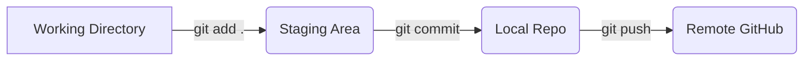

# Git & GitHub Complete Guide

## Core Concepts

### What is Git?
Git is a **free and open-source distributed version control system**. 

### What is a Version Control System (VCS)?
A system that **tracks and records changes** to your files and projects over time. 
* **Revert Changes**: Bring selected files or entire projects back to a previous state.
* **Compare Code**: Review adjustments and modifications across different timelines.
* **Trace Issues**: Identify who last modified a line of code, what the issue is, and when it happened.
* **Primary Types**: Centralised Version Control and Distributed Version Control.

### What is GitHub?
GitHub is a **web-based hosting platform** for Git repositories.

> [!NOTE]
> You can use Git independently on your local computer without GitHub, but you cannot use GitHub without having Git installed.

---

## Git vs. GitHub

| Feature | Git | GitHub |
| :--- | :--- | :--- |
| **Primary Use** | Local version control engine | Cloud-based hosting infrastructure |
| **Function** | Tracks file modifications and history | Stores remote Git repositories |
| **Environment** | Installed locally on your computer | Web interface accessible via browser |

---

## Internal Git Architecture

### 1. Blobs (Binary Large Objects)
* Represents **each unique version** of a file.
* Holds raw file data without saving its metadata.
* Files are **content-addressed** in the database rather than tracked by file names.
* Every blob is identified by a unique **SHA1 hash**.

### 2. Trees
* Represents a **project directory** structure.
* Houses individual blobs and nested sub-directories.
* Acts as a binary file storing references to its internal blobs and SHA1 sub-trees.

### 3. Commits
* Records the **current snapshots** of your overall repository.
* Acts like a single node within a traditional **linked list**.
* Every commit object retains a direct pointer backward to its parent commit.
* Commits containing **multiple parents** indicate a merge event between branches.

---

## Standard Git Workflow



1. **Modify**: Edit files directly inside your active working directory.
2. **Stage**: Add modified files to the staging index area to prepare them.
3. **Commit**: Save snapshots permanently to your local Git directory history.
4. **Push**: Upload your saved local commits to a remote hosting network like GitHub.

---

## Essential Commands & Terminal Operations

### Global Configuration
Run these first to establish your identity credentials:
```bash
git config --global user.name "Akshay"
git config --global user.email "akshay@gmail"
```

### Local Operations
* `git init` — Initialize an empty Git repository inside a folder.
* `git add .` — Stage all file creations and adjustments for tracking.
* `git rm --cached <file>` — Remove a targeted file from staging while preserving it locally.
* `git commit -m "Adding demo file"` — Create a history snapshot with a descriptive message.

### Remote Operations
* `git remote -v` — Audit and verify if a remote backup path is configured.
* `git remote add origin https://github.com` — Link your local directory to a newly created GitHub workspace repository.
* `git push origin master` — Upload local commits securely to the remote master branch.
* `git clone` — Copy an existing cloud repository into a local folder path.
* `git pull` — Download and merge the latest project changes directly into your active local workspace.

### Authentication Setups
* `git config --global credential.helper manager` — Cache login credentials securely inside your OS toolset.
* `ssh-keygen -t rsa -b 4096 -C "akshaysharmas2305@gmail.com"` — Generate a secure 4096-bit SSH key pair for passwordless validation.
* `cat githubssh.pub` — Output your public key contents to copy over to your GitHub settings page.

 git branch

git checkout  -b feature to create new branch

git checkout master - to switch branch

git diff main