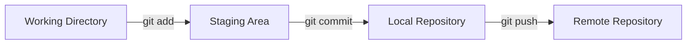
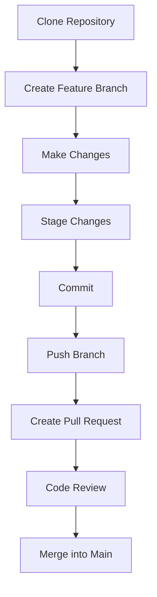

## 1. Overview

### What is Git?

**Git** is a free and open-source **distributed version control system (DVCS)** used to track changes in files and source code over time.

Git allows developers to:

- Track changes in a project
- Compare different versions of files
- Restore previous versions
- Work on multiple features simultaneously using branches
- Collaborate with other developers
- Maintain a complete history of a project

> [!important]
> Git works locally on your computer. You can use Git without GitHub.

---

### What is a Version Control System (VCS)?

A **Version Control System** tracks and records changes made to files over time.

#### Benefits

- **Revert changes** — Restore files or projects to a previous version.
- **Compare changes** — See what changed between versions.
- **Track history** — Know what changed, when it changed, and who changed it.
- **Collaborate** — Multiple developers can work on the same project.
- **Experiment safely** — Create branches without affecting the main project.

### Types of Version Control Systems

1. **Local VCS**
2. **Centralized VCS**
3. **Distributed VCS**

Git is a **Distributed Version Control System**.

---

## 2. What is GitHub?

**GitHub** is a cloud-based platform for hosting and collaborating on Git repositories.

GitHub provides features such as:

- Remote repository hosting
- Pull requests
- Code reviews
- Issue tracking
- Project management
- GitHub Actions for CI/CD
- Collaboration and access control

> [!note]
> Git and GitHub are different things. Git is the version control system; GitHub is a platform that hosts Git repositories.

---

## 3. Git vs GitHub

| Feature | Git | GitHub |
|---|---|---|
| **Type** | Version control system | Cloud hosting platform |
| **Primary Use** | Track changes and history | Host and collaborate on repositories |
| **Location** | Local computer | Remote/cloud |
| **Works Offline** | Yes | Mostly requires internet |
| **Branching** | Yes | Hosts Git branches |
| **Collaboration** | Through Git remotes | Provides collaboration tools |
| **Interface** | Terminal and GUI tools | Web interface, CLI, API |

---

# 4. Important Git Concepts

## Repository

A **repository (repo)** is a project folder tracked by Git.

A repository contains:

- Project files
- Complete change history
- Branches
- Commits
- Git configuration

A Git repository contains a hidden `.git` directory that stores Git's internal data.

---

## Working Directory

The **working directory** contains the actual files you are currently editing.

Example:

```text
my-project/
├── index.html
├── app.js
├── README.md
└── .git/
```

When you modify `app.js`, the change first exists in the **working directory**.

---

## Staging Area

The **staging area** (also called the **index**) is where you select changes that should be included in the next commit.

Example:

```text
Working Directory
       ↓
    git add
       ↓
 Staging Area
       ↓
  git commit
       ↓
 Local Repository
```

This allows you to choose exactly which changes belong in a commit.

---

## Commit

A **commit** is a snapshot of your staged changes.

Example:

```text
Commit A
   ↓
Commit B
   ↓
Commit C
```

Every commit contains:

- Snapshot of project files
- Commit message
- Author information
- Timestamp
- Parent commit reference
- Unique identifier (hash)

Example:

```bash
git commit -m "Add login functionality"
```

---

## Branch

A **branch** is an independent line of development.

The default branch is commonly called:

```text
main
```

Example:

```text
main
 A ─── B ─── C
            \
feature      D ─── E
```

Branches allow developers to work on new features without directly affecting the main branch.

---

## Remote

A **remote** is a connection between your local repository and another repository hosted elsewhere.

The most common remote name is:

```text
origin
```

Example:

```text
Local Repository
       │
       │ git push / git pull
       ▼
GitHub Repository (origin)
```

---

# 5. Internal Git Architecture

Git internally stores data as objects.

The main Git objects are:

1. Blob
2. Tree
3. Commit
4. Tag

---

## 5.1 Blobs

A **blob** stores the contents of a file.

Important points:

- Blob = file content
- Does not store the filename itself
- Content is stored using a hash
- Identical content can share the same object

> [!note]
> Modern Git can use SHA-256 repositories, although SHA-1 has historically been the default object format.

Example conceptually:

```text
Blob
└── Contents of app.js
```

---

## 5.2 Trees

A **tree** represents a directory.

It stores references to:

- Blobs (files)
- Other trees (subdirectories)
- File names
- File modes/permissions

Example:

```text
Project Tree
│
├── index.html → Blob
├── app.js → Blob
└── src/ → Tree
           └── utils.js → Blob
```

---

## 5.3 Commits

A **commit** points to a tree representing the project snapshot.

A commit also contains:

- Author
- Committer
- Timestamp
- Commit message
- Parent commit(s)

Example:

```text
Commit C
   │
   ├── Project Tree
   │
   └── Parent → Commit B
                  │
                  └── Parent → Commit A
```

A merge commit can have multiple parents.

---

# 6. The Standard Git Workflow



## Step 1: Modify

Edit files in your working directory.

```text
app.js modified
```

---

## Step 2: Check Status

```bash
git status
```

This shows:

- Modified files
- Staged files
- Untracked files

---

## Step 3: Stage Changes

Stage a specific file:

```bash
git add app.js
```

Stage all changes:

```bash
git add .
```

---

## Step 4: Commit Changes

```bash
git commit -m "Add authentication feature"
```

A commit saves the staged changes to your **local Git history**.

---

## Step 5: Push Changes

```bash
git push origin main
```

This uploads commits to the remote repository.

---

# 7. Git Installation and Initial Configuration

## Check Git Version

```bash
git --version
```

---

## Configure Username

```bash
git config --global user.name "Your Name"
```

---

## Configure Email

```bash
git config --global user.email "your-email@example.com"
```

---

## View Configuration

```bash
git config --list
```

---

## View Specific Configuration

```bash
git config user.name
git config user.email
```

> [!tip]
> Use the same email address associated with your GitHub account if you want GitHub to associate commits with your profile.

---

# 8. Creating a New Repository

## Initialize a Repository

Navigate into your project folder:

```bash
cd my-project
```

Initialize Git:

```bash
git init
```

This creates the hidden `.git` directory.

---

## Check Repository Status

```bash
git status
```

---

# 9. Tracking Files

## Add a Specific File

```bash
git add file.txt
```

## Add Multiple Files

```bash
git add file1.txt file2.txt
```

## Add Everything

```bash
git add .
```

---

## Remove a File From the Staging Area

Keep the file locally but remove it from Git staging:

```bash
git restore --staged <file>
```

Another commonly used command:

```bash
git reset HEAD <file>
```

---

## Stop Tracking a File but Keep It Locally

```bash
git rm --cached <file>
```

Example:

```bash
git rm --cached .env
```

This is useful when a file was accidentally committed or tracked.

---

# 10. Commits

## Create a Commit

```bash
git commit -m "Add demo file"
```

## Commit All Tracked Modified Files

```bash
git commit -am "Update existing files"
```

> [!warning]
> `git commit -am` does **not** automatically add new untracked files.

---

## View Commit History

```bash
git log
```

Compact version:

```bash
git log --oneline
```

Graph view:

```bash
git log --oneline --graph --all
```

---

# 11. Branching

## View Branches

```bash
git branch
```

The currently active branch is marked with:

```text
*
```

---

## Create a Branch

```bash
git branch feature
```

---

## Switch Branches

Modern command:

```bash
git switch feature
```

Older command:

```bash
git checkout feature
```

---

## Create and Switch to a Branch

Modern command:

```bash
git switch -c feature
```

Older command:

```bash
git checkout -b feature
```

---

## Rename a Branch

Rename the current branch:

```bash
git branch -m new-name
```

---

## Delete a Branch

Safe delete:

```bash
git branch -d feature
```

Force delete:

```bash
git branch -D feature
```

> [!warning]
> Force deletion can remove a branch that has unmerged commits.

---

# 12. Merging Branches

Suppose you have:

```text
main
A ─── B ─── C

feature
        B ─── D ─── E
```

Switch to the branch where you want to merge:

```bash
git switch main
```

Merge the feature:

```bash
git merge feature
```

Result:

```text
main
A ─── B ─── C ─── F
         \         /
feature   D ─── E
```

---

# 13. Merge Conflicts

A **merge conflict** occurs when Git cannot automatically decide how to combine changes.

This usually happens when:

- Two branches modify the same lines differently.
- One branch deletes a file while another modifies it.

Example conflict:

```text
<<<<<<< HEAD
Hello from main branch
=======
Hello from feature branch
>>>>>>> feature
```

## Resolving a Merge Conflict

### 1. Open the conflicted file

Decide which version to keep.

### 2. Remove conflict markers

Remove:

```text
<<<<<<<
=======
>>>>>>>
```

### 3. Stage the resolved file

```bash
git add <file>
```

### 4. Complete the merge

```bash
git commit
```

---

## Abort a Merge

If you want to cancel the merge:

```bash
git merge --abort
```

This attempts to return the repository to its state before the merge started.

---

# 14. Remote Repositories

## View Remotes

```bash
git remote -v
```

---

## Add a Remote

```bash
git remote add origin <repository-url>
```

Example:

```bash
git remote add origin https://github.com/USERNAME/REPOSITORY.git
```

---

## Change Remote URL

```bash
git remote set-url origin <new-url>
```

---

## Remove a Remote

```bash
git remote remove origin
```

---

# 15. Push and Pull

## Push a Branch

```bash
git push origin main
```

---

## Set Upstream Branch

```bash
git push -u origin feature
```

After setting the upstream, future pushes can often be done with:

```bash
git push
```

---

## Pull Changes

```bash
git pull
```

Conceptually:

```text
git pull = git fetch + git merge
```

---

## Fetch Changes Without Merging

```bash
git fetch
```

Use `fetch` when you want to download remote changes and inspect them before merging.

---

# 16. Clone a Repository

Clone an existing repository:

```bash
git clone <repository-url>
```

Example:

```bash
git clone https://github.com/USERNAME/REPOSITORY.git
```

Clone into a custom directory:

```bash
git clone <repository-url> my-project
```

---

# 17. Comparing Changes

## Compare Working Directory and Staging Area

```bash
git diff
```

---

## Compare Staged Changes and Last Commit

```bash
git diff --staged
```

---

## Compare Two Branches

```bash
git diff main feature
```

---

## Compare Two Commits

```bash
git diff <commit1> <commit2>
```

---

# 18. Undoing Changes

> [!warning]
> Git undo commands can permanently remove work. Always check `git status` and `git log` before running destructive commands.

## Discard Unstaged Changes

```bash
git restore <file>
```

Discard all unstaged changes:

```bash
git restore .
```

---

## Unstage a File

```bash
git restore --staged <file>
```

---

## Undo the Last Commit but Keep Changes Staged

```bash
git reset --soft HEAD~1
```

---

## Undo the Last Commit and Keep Changes Unstaged

```bash
git reset HEAD~1
```

This is equivalent to a mixed reset.

```bash
git reset --mixed HEAD~1
```

---

## Undo the Last Commit and Delete Changes

```bash
git reset --hard HEAD~1
```

> [!danger]
> `git reset --hard` can permanently delete uncommitted changes.

---

# 19. Git Reset Modes

| Command | Commit History | Staging Area | Working Directory |
|---|---|---|---|
| `git reset --soft` | Changed | Preserved | Preserved |
| `git reset --mixed` | Changed | Reset | Preserved |
| `git reset --hard` | Changed | Reset | Reset |

Default mode:

```bash
git reset
```

is usually equivalent to:

```bash
git reset --mixed
```

---

# 20. Git Revert

`git revert` creates a **new commit that reverses a previous commit**.

```bash
git revert <commit-hash>
```

Unlike `git reset`, revert is generally safer for shared/public history because it does not rewrite existing commit history.

---

# 21. Git Restore vs Checkout

Modern Git separates some operations into clearer commands.

## Restore Files

```bash
git restore file.txt
```

## Switch Branches

```bash
git switch main
```

Older Git command:

```bash
git checkout
```

could do both:

```bash
git checkout main
```

and:

```bash
git checkout -- file.txt
```

> [!tip]
> Prefer `git switch` for branches and `git restore` for files when possible because their intent is clearer.

---

# 22. Authentication

GitHub no longer generally supports using an account password directly for Git operations over HTTPS.

Common authentication methods:

1. Personal Access Token (PAT)
2. SSH keys
3. Credential managers

---

## HTTPS Credential Manager

On supported systems:

```bash
git config --global credential.helper manager
```

Your exact credential helper may depend on your operating system.

---

## SSH Authentication

Generate a modern SSH key:

```bash
ssh-keygen -t ed25519 -C "your-email@example.com"
```

Older RSA alternative:

```bash
ssh-keygen -t rsa -b 4096 -C "your-email@example.com"
```

Display the public key:

```bash
cat ~/.ssh/id_ed25519.pub
```

Copy the public key and add it to your GitHub account's SSH keys.

Test the connection:

```bash
ssh -T git@github.com
```

---

# 23. .gitignore

A `.gitignore` file tells Git which files should not be tracked.

Example:

```gitignore
# Dependencies
node_modules/

# Environment variables
.env

# Logs
*.log

# OS files
.DS_Store
```

> [!important]
> `.gitignore` does not automatically stop tracking files that are already committed. Use `git rm --cached <file>` for files already being tracked.

---

# 24. Git Status Symbols

Example:

```text
M  file.txt
 M file2.txt
?? newfile.txt
```

Meaning:

| Symbol | Meaning |
|---|---|
| `M ` | Modified and staged |
| ` M` | Modified but not staged |
| `??` | Untracked file |
| `A` | Added |
| `D` | Deleted |

---

# 25. HEAD Explained

`HEAD` represents your current position in Git history.

Example:

```text
A ─── B ─── C
            ↑
           HEAD
```

`HEAD` usually points to the currently checked-out branch.

Previous commit:

```bash
HEAD~1
```

Two commits back:

```bash
HEAD~2
```

---

# 26. Common Git Workflow for a Feature

```bash
# Check current status
git status

# Get latest changes
git pull

# Create a feature branch
git switch -c feature/login

# Make changes...

# Check changes
git status
git diff

# Stage changes
git add .

# Commit changes
git commit -m "Add login feature"

# Push branch
git push -u origin feature/login
```

---

# 27. Typical Collaboration Workflow



---

# 28. Pull Requests

A **Pull Request (PR)** is primarily a collaboration feature provided by hosting platforms such as GitHub.

Typical workflow:

1. Create a feature branch.
2. Make changes.
3. Commit changes.
4. Push the branch.
5. Create a Pull Request.
6. Request review.
7. Resolve feedback.
8. Merge into the target branch.

> [!note]
> Pull Requests are not a core Git feature. Git itself handles commits and branches; platforms such as GitHub provide the PR interface and workflow.

---

# 29. Useful Git Commands Cheat Sheet

## Repository

```bash
git init
git clone <url>
git status
```

## Configuration

```bash
git config --global user.name "Name"
git config --global user.email "email@example.com"
git config --list
```

## Staging

```bash
git add <file>
git add .
git restore --staged <file>
```

## Commits

```bash
git commit -m "message"
git log
git log --oneline
```

## Branches

```bash
git branch
git branch <branch-name>
git switch <branch-name>
git switch -c <branch-name>
git branch -d <branch-name>
```

## Remote

```bash
git remote -v
git remote add origin <url>
git push
git pull
git fetch
```

## Merging

```bash
git merge <branch-name>
git merge --abort
```

## Comparing

```bash
git diff
git diff --staged
git diff main feature
```

## Undoing

```bash
git restore <file>
git restore --staged <file>
git reset --soft HEAD~1
git reset HEAD~1
git reset --hard HEAD~1
git revert <commit>
```

---

# 30. Important Differences to Remember

| Concept | Meaning |
|---|---|
| `git add` | Moves changes to staging |
| `git commit` | Saves staged changes locally |
| `git push` | Uploads local commits to remote |
| `git fetch` | Downloads remote changes without merging |
| `git pull` | Downloads and integrates remote changes |
| `git merge` | Combines branch histories |
| `git rebase` | Replays commits onto another base |
| `git reset` | Moves branch/history pointers and can modify staging/working files |
| `git revert` | Creates a new commit that reverses an earlier commit |
| `git restore` | Restores file content |
| `git switch` | Changes branches |

---

# 31. Best Practices

- Write meaningful commit messages.
- Make small, focused commits.
- Pull/fetch regularly when collaborating.
- Use feature branches for new work.
- Do not commit secrets such as passwords or API keys.
- Use `.gitignore` for generated files and local secrets.
- Review changes using `git diff` before committing.
- Check `git status` frequently.
- Avoid force-pushing shared branches unless your team workflow explicitly allows it.
- Prefer `git revert` over history rewriting for public/shared commits.
- Create Pull Requests for code review before merging important changes.

---

# 32. Recommended Commit Message Format

Simple format:

```text
type: short description
```

Examples:

```text
feat: add user authentication
fix: resolve login validation issue
docs: update installation guide
refactor: simplify database connection
test: add authentication tests
```

A good commit message should be:

- Clear
- Short
- Specific
- Written in imperative style when possible

Example:

```text
Add login validation
```

Instead of:

```text
Added some login changes
```

---

# 33. Mental Model

The easiest way to remember Git is:

```text
Working Directory
      │
      │ Edit files
      ▼
Staging Area
      │
      │ git add
      ▼
Local Repository
      │
      │ git commit
      ▼
Remote Repository
      │
      │ git push
      ▼
GitHub / Git Server
```

Or simply:

```text
Edit → Add → Commit → Push
```

And when collaborating:

```text
Fetch/Pull → Branch → Edit → Add → Commit → Push → Pull Request → Review → Merge
```

---

# Related Notes

- [[Git Branching]]
- [[Git Merge]]
- [[Git Rebase]]
- [[GitHub]]
- [[Git Commands Cheat Sheet]]
- [[SSH Authentication]]
- [[Version Control]]